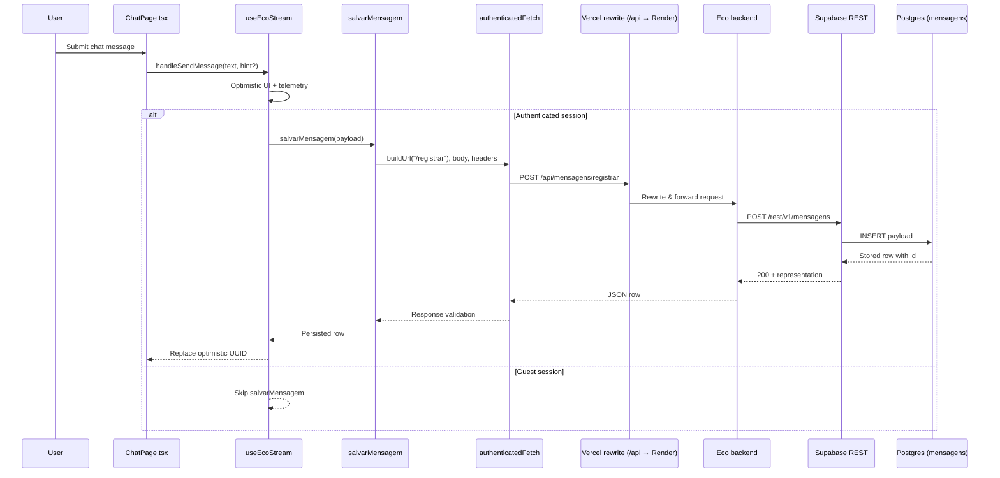

# Client-to-Database Request Flow

This document traces how a chat message moves from the Eco browser client to the Supabase `mensagens` table. It focuses on the frontend entry points so contributors can understand which layer is responsible for optimistic updates, authentication headers, routing, and persistence.

## Components in the path

- **`ChatPage`** – wires the composer send action to the streaming hook and applies guest/session guards before delegating. 【F:src/pages/ChatPage.tsx†L281-L349】
- **`useEcoStream`** – guards concurrent sends, performs optimistic updates, and exposes `handleSendMessage` for the UI. 【F:src/hooks/useEcoStream.ts†L240-L338】
- **`salvarMensagem`** – builds the JSON payload for the REST API and validates the response schema. 【F:src/api/mensagem.ts†L56-L90】
- **`authenticatedFetch`** – attaches the logged-in bearer token (when available) before issuing the HTTP request. 【F:src/api/mensagem.ts†L39-L54】
- **Vercel rewrite** – forwards any `/api/*` request from the SPA to the Render backend. 【F:vercel.json†L1-L6】
- **Eco backend → Supabase REST** – the Render service calls Supabase’s REST gateway, which ultimately writes to Postgres.

## Step-by-step flow

1. **User submits a message.** `ChatPage` calls `useEcoStream.handleSendMessage`, passing the input text and any optional hint. 【F:src/pages/ChatPage.tsx†L296-L349】
2. **Optimistic state is prepared.** `useEcoStream` appends the user turn to the local store, logs diagnostics, and triggers scrolling so the UI reflects the pending message immediately. 【F:src/hooks/useEcoStream.ts†L240-L307】
3. **Feature code invokes the client endpoint.** When a flow needs to persist a chat turn, it calls `salvarMensagem`, which serializes the payload and resolves the `/api/mensagens/registrar` URL through `buildUrl`. 【F:src/api/mensagem.ts†L18-L89】
4. **Authentication headers are attached.** `authenticatedFetch` looks up the Supabase session via the shared client and injects `Authorization: Bearer <token>` when present. Requests without a session travel without the header, letting the backend treat them as guests. 【F:src/api/mensagem.ts†L39-L54】
5. **Browser request hits the Vercel edge.** Because the SPA runs on Vercel, `/api/mensagens/registrar` is rewritten to `https://ecobackend888.onrender.com/api/mensagens/registrar`, which is the Eco backend hosted on Render. 【F:vercel.json†L1-L6】
6. **Backend proxies to Supabase REST.** The Render service forwards the payload to Supabase’s `/rest/v1/mensagens` endpoint, adding the anon key so the row can be inserted into Postgres. (The anon key value lives in the backend environment.)
7. **Supabase stores and echoes the row.** With `Prefer: return=representation`, Supabase responds with the inserted row, including the generated `id`. `salvarMensagem` validates that the response includes an `id` before resolving to its caller. 【F:src/api/mensagem.ts†L56-L90】

## Mermaid sequence diagram

## HTTP request details

- **Method & URL:** `POST /api/mensagens/registrar` from the browser; rewritten to Render → Supabase `/rest/v1/mensagens`. 【F:src/api/mensagem.ts†L18-L109】【F:vercel.json†L1-L6】
- **Headers:** `Content-Type: application/json` plus `Authorization: Bearer <token>` when `supabase.auth.getSession()` returns a user session. 【F:src/api/mensagem.ts†L28-L51】
- **Body fields:** At minimum `conteudo` (message text) and `usuario_id`; optional flags like `salvar_memoria` pass through untouched. 【F:src/api/mensagem.ts†L13-L17】【F:src/api/mensagem.ts†L72-L89】
- **Response:** JSON representation of the inserted row, enforced by `Prefer: return=representation`; missing IDs trigger an error. 【F:src/api/mensagem.ts†L56-L109】

## Failure handling

- `salvarMensagem` throws descriptive errors containing the status code and body text so upstream logging is actionable. 【F:src/api/mensagem.ts†L84-L109】
- `authenticatedFetch` only mutates headers, so callers can still override fetch options (timeouts, retries) when needed. 【F:src/api/mensagem.ts†L28-L51】

## Key takeaways

- Shared helpers (`salvarMensagem`, `listarMensagens`, etc.) centralize REST conventions—URL building, headers, and response validation—so the rest of the app can call persistence with a single import. 【F:src/api/mensagem.ts†L18-L159】
- The same Supabase session retrieved in `authenticatedFetch` powers real-time listeners elsewhere, ensuring a consistent identity across features. 【F:src/lib/supabaseClient.ts†L1-L6】
- Vercel’s rewrite guarantees the browser never talks to Supabase directly, allowing backend-side validation and environment secret management before data hits the database. 【F:vercel.json†L1-L6】
