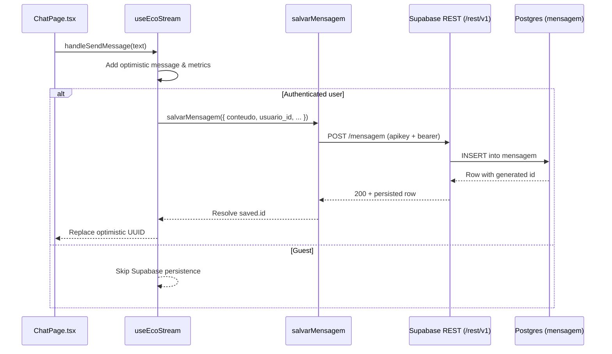

# Client-to-Database Request Flow

This document explains how a chat message travels from the browser all the way to the `mensagem` table in Supabase. It focuses on the code paths that run inside the frontend repo so that contributors can understand which layers are responsible for networking, identity headers, and database persistence.

## High-level pipeline

1. **Chat UI dispatches the send action.** `ChatPage` wires the composer to `useEcoStream.handleSendMessage`, which is the entry point for every outbound chat message. 【F:src/pages/ChatPage.tsx†L1-L208】【F:src/hooks/useEcoStream.ts†L424-L491】
2. **`useEcoStream` persists authenticated messages.** When the hook detects a Supabase user, it optimistically adds the message to local state and calls `salvarMensagem` before contacting the streaming backend. Guests skip this persistence step. 【F:src/hooks/useEcoStream.ts†L454-L490】
3. **`salvarMensagem` builds the Supabase REST request.** The helper serializes the payload and forwards it to `supabaseRestRequest`, which attaches the anon key, the user access token (if present), and the `Prefer: return=representation` hint so the row comes back in the response. 【F:src/api/mensagem.ts†L70-L93】
4. **`supabaseRestRequest` signs and sends the HTTP call.** It resolves the `apikey` and `Authorization` headers, then executes a `fetch` against `${VITE_SUPABASE_URL}/rest/v1/mensagem`. Any non-2xx status is promoted to a descriptive error message. 【F:src/api/mensagem.ts†L34-L68】
5. **Supabase REST forwards the insert to Postgres.** The `/rest/v1/mensagem` endpoint maps directly to the `mensagem` table, so the JSON body is inserted and the created row (including the generated `id`) is returned to the client. 【F:src/api/mensagem.ts†L70-L93】
6. **The hook reconciles optimistic state.** Once the promise resolves, `useEcoStream` swaps the temporary UUID with the real database ID and continues the streaming flow. Failures leave the optimistic ID in place but are logged to the console in development mode. 【F:src/hooks/useEcoStream.ts†L472-L491】

> ℹ️  `src/lib/supabaseClient.ts` centralizes the authenticated client that is reused for the `getSession()` lookup before every REST call, ensuring the same credentials gate both real-time and HTTP paths. 【F:src/lib/supabaseClient.ts†L1-L6】

## How `/api` requests reach the backend

While persistence talks directly to Supabase, most other API calls (e.g. `/api/ask-eco`) go through the `apiFetch` helper. The helper resolves `VITE_API_URL`/`VITE_API_BASE_URL` to an origin and combines it with the requested path. In production, every `/api/*` request is then rewritten by Vercel to `https://ecobackend888.onrender.com/api/*`, keeping client code free from environment-specific URLs. 【F:src/constants/api.ts†L19-L85】【F:vercel.json†L1-L5】

`apiFetch` also injects the guest/session headers from `buildIdentityHeaders`, letting the backend correlate anonymous traffic without direct Supabase access. 【F:src/lib/guestId.ts†L12-L72】

## Mermaid sequence diagram

## Key takeaways

- All Supabase calls share the same typed helpers (`salvarMensagem`, `listarMensagens`, etc.), which guarantee consistent headers and error handling. 【F:src/api/mensagem.ts†L70-L159】
- Environment variables (`VITE_SUPABASE_URL`, `VITE_SUPABASE_ANON_KEY`) are required at build time so the REST base URL and authentication tokens are available on the client. 【F:src/api/mensagem.ts†L4-L12】
- Frontend `/api/*` calls are environment-agnostic thanks to the `buildApiUrl` logic plus the rewrite rules that proxy to the Render backend in production. 【F:src/constants/api.ts†L19-L85】【F:vercel.json†L1-L5】
