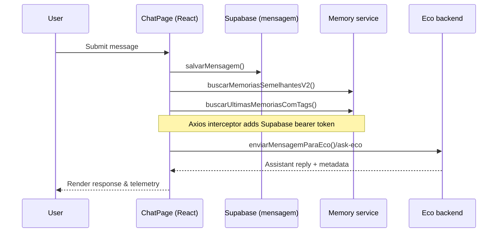

# Client Request Flow

This document describes how a chat message travels through the Eco frontend once a person interacts with the chat UI. It covers the primary client-side responsibilities, how we enrich a message with contextual data, and the way we authenticate and deliver the request to the backend.

## High-level steps

1. **User input captured in the chat UI.** `ChatPage` validates and stages the message, displaying it immediately in the conversation so the interface feels responsive.【F:src/pages/ChatPage.tsx†L203-L276】
2. **Message is persisted in Supabase.** We call `salvarMensagem`, which inserts the payload into the `mensagem` table through the shared Supabase client, guaranteeing the conversation history is stored before any external calls happen.【F:src/pages/ChatPage.tsx†L218-L224】【F:src/api/mensagem.ts†L4-L27】【F:src/lib/supabaseClient.ts†L1-L6】
3. **Contextual memories are fetched.** In parallel we ask two memory endpoints (`/memorias/similares_v2` with fallback and `/memorias` filtered by tags) to recover relevant memories that will accompany the prompt. Both helpers reuse the shared Axios instance so that authentication headers and error handling stay consistent.【F:src/pages/ChatPage.tsx†L224-L268】【F:src/api/memoriaApi.ts†L204-L319】
4. **Supabase session token is attached automatically.** Every request made through `api` pulls the current Supabase session and injects its bearer token, enabling backend Row Level Security (RLS) without forcing each caller to repeat that logic.【F:src/api/axios.ts†L1-L25】
5. **Prompt is delivered to the Eco backend.** Once the prompt has been assembled with system hints, contextual memories, and the last user turns, `enviarMensagemParaEco` posts it to `/ask-eco`. The helper normalises payloads, validates responses, and surfaces backend errors in a user-friendly way.【F:src/pages/ChatPage.tsx†L261-L292】【F:src/api/ecoApi.ts†L15-L60】
6. **UI updates with the assistant reply.** The returned text is rendered in the chat window, any structured metadata emitted by the backend is parsed, and telemetry events track the exchange.【F:src/pages/ChatPage.tsx†L274-L292】

## Mermaid sequence diagram

## Authentication touchpoints

- Supabase credentials (`VITE_SUPABASE_URL` and `VITE_SUPABASE_ANON_KEY`) initialise the singleton client used for both direct Supabase CRUD operations and session retrieval.【F:src/lib/supabaseClient.ts†L1-L6】
- The Axios instance (`api`) centralises the API base URL, credentials policy, and Supabase bearer injection. Any new client-side request should reuse this instance to inherit the existing authentication behaviour.【F:src/api/axios.ts†L5-L25】

## Error handling strategy

- Memory helper utilities map server responses to a canonical shape, falling back between v2 and v1 endpoints and translating HTTP failures into actionable error messages.【F:src/api/memoriaApi.ts†L201-L319】
- `enviarMensagemParaEco` decorates backend errors with HTTP details so the chat UI can surface meaningful feedback and log issues for observability.【F:src/api/ecoApi.ts†L32-L59】

By following this flow the client ensures that every outbound request is authenticated, contextualised, and recoverable while keeping the user interface responsive.
