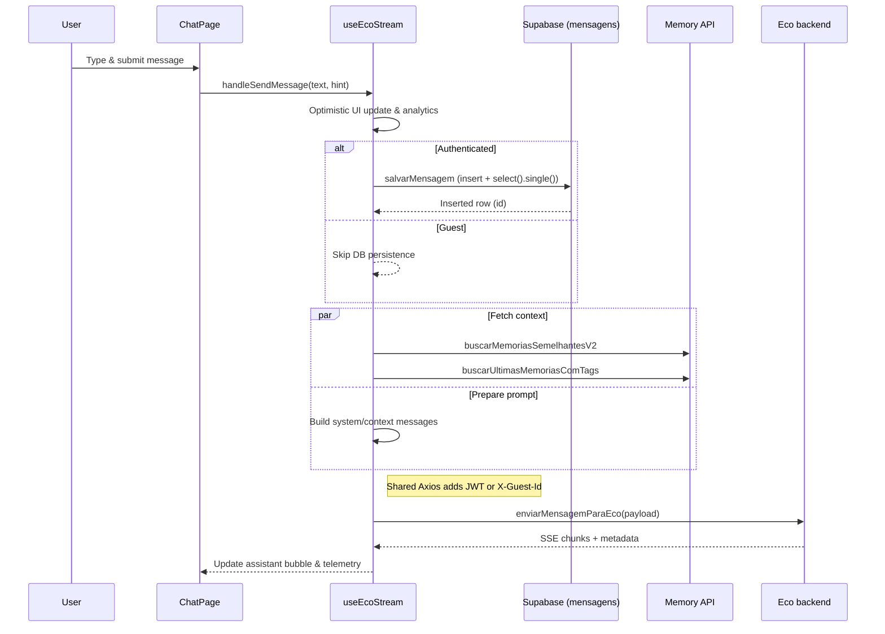

# Client Request Flow

This guide documents the full journey of a chat request from the Eco client UI until the response
streams back to the browser. It reflects the current implementation so new contributors can reason
about the data path end-to-end.

## End-to-end Sequence <!-- ref:sequence -->

1. **Chat UI delega para o hook de streaming.** `ChatPage` conecta o campo de entrada ao
   `useEcoStream`, aplicando limites de convidado e encaminhando o texto (e um hint opcional) sempre
   que a pessoa envia uma mensagem.
2. **`useEcoStream` cria o estado otimista.** O hook bloqueia envios concorrentes, adiciona a
   mensagem do usuário na store local, controla o scroll e dispara métricas antes de falar com
   serviços remotos. <!-- ref:useEcoStream-optimistic -->
3. **Usuários autenticados persistem primeiro no Supabase.** Ao detectar uma sessão válida, o hook
   chama `salvarMensagem`, que retorna exatamente uma linha da tabela `mensagens` graças a
   `.select('*').single()`. O ID real substitui o UUID otimista no store e nas métricas. <!-- ref:persist -->
4. **Convidados não tentam persistir.** Sem sessão Supabase, o hook mantém somente o ID local, mas
   registra o envio com `X-Guest-Id` para que o backend reconheça o convidado com consistência.
5. **O contexto é recuperado das APIs de memória.** Para contas autenticadas, o hook busca memórias
   semelhantes e memórias por tag em paralelo, com timeouts curtos para evitar travar o prompt.
6. **Prompt final é montado e enviado.** `useEcoStream` agrega memórias relevantes, mensagens
   recentes e dicas de sistema, então chama `enviarMensagemParaEco` usando o cliente Axios
   compartilhado.
7. **O backend responde via SSE.** Os handlers atualizam o balão da Eco, guardam metadata, disparam
   celebrações e finalizam as métricas com o ID persistido quando disponível. <!-- ref:streaming -->

## Mermaid Sequence Diagram <!-- ref:diagram -->

## Authentication and Database Touchpoints <!-- ref:auth -->

- **Autenticado:** O cliente Supabase recupera o JWT atual. O Axios compartilhado envia
  `Authorization: Bearer <jwt>` e `useEcoStream` persiste a mensagem antes de montar o prompt,
  trocando o ID otimista pelo valor real retornado.
- **Convidado:** Sem sessão, o Axios injeta `X-Guest-Id` (UUID persistente). O hook não chama
  `salvarMensagem`, mantém o UUID local para a sessão atual e marca `auth=false` na telemetria.

## Notes on Table Naming <!-- ref:table -->

O projeto usa o nome da tabela `mensagens` de forma consistente em código e documentação. Caso o
schema Supabase esteja configurado com outro nome, alinhe o helper `salvarMensagem` e este documento
para refletir o nome real da tabela.
