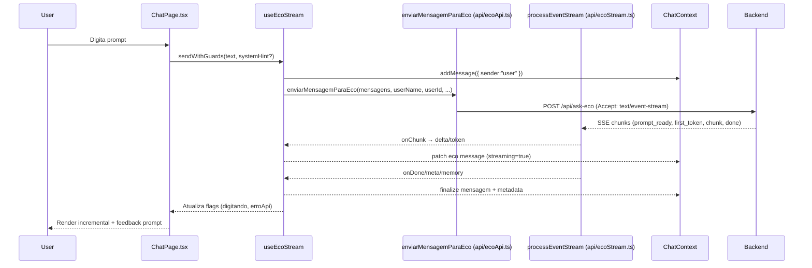
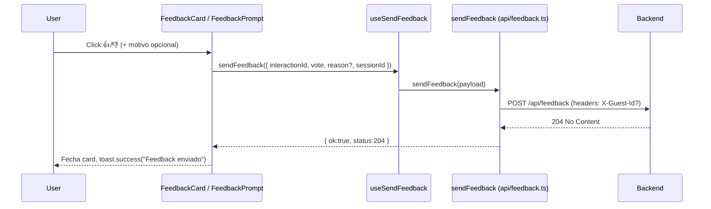

# ECO Frontend Conversation Flow

## Overview
- **Objetivo**: entregar a experiência de chat em `ChatPage.tsx`, orquestrando envio de prompts, streaming incremental da Eco e coleta de feedback contextualizado. 【F:src/pages/ChatPage.tsx†L1-L213】【F:src/hooks/useEcoStream.ts†L1-L334】
- **Contratos com o backend**:
  - `POST /api/ask-eco` responde via **SSE** (fetch streaming) e devolve `text/event-stream` com eventos `prompt_ready`, `first_token`, `chunk` e `done`. 【F:src/api/ecoApi.ts†L101-L209】【F:src/api/ecoStream.ts†L1-L120】
  - `POST /api/feedback` confirma votos com `204 No Content`; qualquer corpo diferente dispara tratamento de erro e toasts. 【F:src/api/feedback.ts†L1-L120】【F:src/components/FeedbackCard.tsx†L70-L150】

## Sequence Diagram — Chat


## Sequence Diagram — Feedback


## Flowchart — Component & Data Flow
```mermaid
flowchart TD
  ChatPage[ChatPage.tsx]
  ChatInput[ChatInput]
  StreamHook[useEcoStream]
  ApiEco[enviarMensagemParaEco\n(api/ecoApi.ts)]
  StreamParser[processEventStream\n(api/ecoStream.ts)]
  MessageStore[ChatContext]
  MessageList[EcoMessageWithAudio / ChatMessage]
  FeedbackNodes[FeedbackPrompt & FeedbackCard]
  ApiFeedback[sendFeedback\n(api/feedback.ts)]
  ToastBus[toast dispatcher\n(utils/toast.ts)]
  DevHUD[EcoLoopHud (F12)]
  DiagApi[/GET /api/diag/last?response_id=…/]

  ChatPage --> ChatInput
  ChatPage --> StreamHook
  ChatInput --> StreamHook
  StreamHook --> ApiEco
  ApiEco --> StreamParser
  StreamParser --> MessageStore
  MessageStore --> MessageList
  MessageList --> FeedbackNodes
  FeedbackNodes --> ApiFeedback
  ApiFeedback --> ToastBus
  DevHUD --> DiagApi
```

## Function Contracts (TypeScript)
```ts
import type { Message } from "../contexts/ChatContext";
import type {
  EcoEventHandlers,
  EcoStreamResult,
} from "../api/ecoStream";
import type { SendFeedbackInput, SendFeedbackResult } from "../api/feedback";

export type UseEcoStreamOptions = {
  messages: Message[];
  addMessage: (message: Message) => void;
  setMessages: React.Dispatch<React.SetStateAction<Message[]>>;
  userId?: string;
  userName: string;
  sessionId: string;
  scrollToBottom: (smooth?: boolean) => void;
  isAtBottom: boolean;
  guestId?: string;
  isGuest?: boolean;
  onUnauthorized?: () => void;
};

export function useEcoStream(opts: UseEcoStreamOptions): {
  handleSendMessage(text: string, systemHint?: string): Promise<void>;
  digitando: boolean;
  erroApi: string | null;
  setErroApi(message: string | null): void;
  pending: boolean;
};

export function enviarMensagemParaEco(
  userMessages: { id?: string; role: string; content: string }[],
  userName?: string,
  userId?: string,
  clientHour?: number,
  clientTz?: string,
  handlers?: EcoEventHandlers,
  options?: { guestId?: string; isGuest?: boolean; signal?: AbortSignal; stream?: boolean },
): Promise<EcoStreamResult>;

export function sendFeedback(input: SendFeedbackInput): Promise<SendFeedbackResult>;
// Sucesso esperado: status === 204 (No Content)
```

## Headers & Identity
- `enviarMensagemParaEco` monta `Content-Type: application/json` e, quando for convidado, injeta `X-Guest-Id` persistido em `api/guestIdentity.ts`. Usuários autenticados levam `Authorization: Bearer <token Supabase>` e `credentials: "include"`. 【F:src/api/ecoApi.ts†L68-L170】【F:src/api/guestIdentity.ts†L1-L120】
- `sendFeedback` replica `Content-Type: application/json`, usa `X-Guest-Id` derivado do `session_id` (ou `getSessionId()`) quando não há `user_id`, e mantém cookies (`credentials: "include"`). 【F:src/api/feedback.ts†L1-L120】
- Sessões anônimas são geradas por `ensureGuestId()` / `getOrCreateGuestId()` e armazenadas em `localStorage` + cookie para reuso cross-tab. 【F:src/api/guestIdentity.ts†L1-L120】

## State & UX Behavior
- Flags `digitando`, `pending` e `erroApi` retornadas por `useEcoStream` controlam spinner, bloqueio do `ChatInput` e banners de erro. O placeholder Eco é removido quando chega `first_token`. 【F:src/hooks/useEcoStream.ts†L200-L520】【F:src/pages/ChatPage.tsx†L74-L208】
- `LoginGateModal` abre automaticamente para convidados que atingem limite (`useGuestGate`). O input fica desabilitado (`disabled`/placeholder) enquanto `pending` ou `guestGate.inputDisabled`. 【F:src/pages/ChatPage.tsx†L36-L210】
- `FeedbackCard` e `FeedbackPrompt` só aparecem após mensagens Eco concluídas e exigem `interactionId`. Estados `sending`/`success` fecham o card e mostram toasts. 【F:src/components/FeedbackCard.tsx†L1-L200】【F:src/components/FeedbackPrompt.tsx†L1-L160】
- Toasters globais são emitidos via `window.dispatchEvent('toast')`, consumidos por `GlobalToast`. 【F:src/utils/toast.ts†L1-L40】

## Debounce & Retry
- Feedback: `sendFeedback` aplica debounce de 300 ms por `interaction_id`, mantendo a última interação e evitando envios duplicados. Há retry automático (`MAX_ATTEMPTS = 2`) com delay de 300 ms para falhas de rede/status 0. 【F:src/api/feedback.ts†L58-L220】
- Chat: abortos manuais cancelam a stream; reconexões dependem da ação do usuário (`handleRetry`). Não há retry automático para SSE, mas erros de rede/CORS exibem mensagens amigáveis. 【F:src/pages/ChatPage.tsx†L124-L188】【F:src/hooks/useEcoStream.ts†L520-L720】

## Error Handling
- Mensagens amigáveis para `network`/`cors` (`resolveFriendlyNetworkError`) e códigos HTTP 401/429/5xx alimentam `erroApi` + toasts contextuais. 【F:src/hooks/useEcoStream.ts†L100-L160】【F:src/hooks/useEcoStream.ts†L1180-L1330】
- `sendFeedback` lança `FeedbackRequestError` com `status` e corpo bruto quando a resposta não é 204; o UI mostra `toast.error` com status. 【F:src/api/feedback.ts†L120-L220】【F:src/components/FeedbackCard.tsx†L104-L160】
- Eventos SSE sem texto disparam `showToast('Sem resposta da Eco')` e mantêm a interface pronta para retry. 【F:src/hooks/useEcoStream.ts†L1160-L1205】

## Environment & Configuration
- `resolveApiUrl` usa `VITE_API_URL`/`VITE_API_BASE_URL` (fallback `same-origin`) para montar endpoints REST. 【F:src/constants/api.ts†L1-L80】
- `VITE_METABASE_URL` (quando definido) transforma o HUD em link direto para dashboards. Outros ambientes usam `/api/diag/last`. 【F:src/components/EcoLoopHud.tsx†L1-L200】
- Flags de desenvolvimento (`import.meta.env.DEV`) habilitam o `EcoLoopHud` (F12) e logs adicionais no stream. 【F:src/hooks/useEcoStream.ts†L25-L60】【F:src/components/EcoLoopHud.tsx†L1-L80】

## Mini HUD “Eco Loop”
- Disponível apenas em dev (`import.meta.env.DEV`). Ouve `window"eco-feedback-update"`, mantém último voto e resultado, e busca snapshots via `GET /api/diag/last?response_id=…` ao apertar F12. 【F:src/components/EcoLoopHud.tsx†L1-L200】
- Se `VITE_METABASE_URL` existir, `EcoLoopHud` rendeiriza o link direto; caso contrário, usa fetch local para diagnóstico. 【F:src/components/EcoLoopHud.tsx†L80-L200】

## Metabase Integration
- Defina `VITE_METABASE_URL` para habilitar anchor direto no HUD (`${VITE_METABASE_URL}/?response_id=…`). TODO: adicionar URL oficial do dashboard quando disponível.

## Manual Test Checklist
1. Abrir `/chat`, enviar mensagem e confirmar stream incremental até o final (placeholder sai ao receber `first_token`).
2. Clicar 👍 na última resposta → confirmar `toast.success` e que o card fecha (status 204 em console). 【F:src/components/FeedbackCard.tsx†L96-L156】
3. Responder outra pergunta, clicar 👎, selecionar motivo e verificar toast de sucesso e ausência de duplicidade em `EcoLoopHud`.
4. (Dev) Pressionar F12 → `EcoLoopHud` mostra último `interaction_id`, snapshot e link Metabase (se configurado). 【F:src/components/EcoLoopHud.tsx†L1-L200】

## Appendix
- [Adicionar URL do dashboard Metabase aqui]
```
