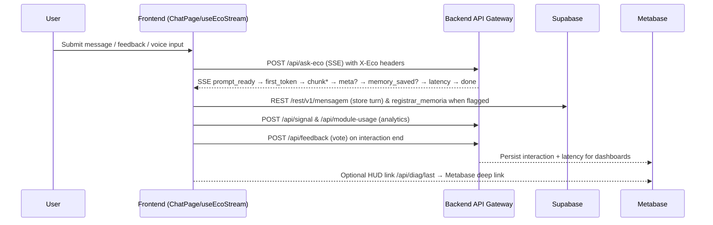

# Summary
- Frontend routes every `/api/*` call through the Render-hosted backend, inheriting SSE support, feedback intake, voice services, and diagnostic tooling from a single origin rewrite for consistency.【F:vercel.json†L1-L5】【F:src/api/ecoApi.ts†L332-L376】
- React hooks centralise transport logic: `useEcoStream` listens to the canonical SSE chain (`prompt_ready` → `first_token` → `chunk*` → `meta?` → `memory_saved?` → `latency` → `done`) and normalises the JSON fallback to the final `done` payload shape, while specialised hooks/components cover feedback, memories, voice, and analytics with consistent identity headers.【F:src/hooks/useEcoStream.ts†L820-L1158】【F:src/api/ecoApi.ts†L200-L343】【F:src/api/feedback.ts†L188-L221】【F:src/lib/guestId.ts†L34-L63】
- Supabase persists profiles and message artifacts via the JS client and REST gateway, aligning table access (`usuarios`, `mensagem`, `usuario`) with the backend RPC surfaces consumed by the app.【F:src/lib/ensureProfile.ts†L13-L49】【F:src/api/mensagem.ts†L14-L159】【F:src/api/usuario.ts†L13-L26】

# Backend Overview
- **Routing & Identity** – Vercel rewrites forward `/api/*` to `ecobackend888`, where `buildIdentityHeaders` injects `X-Eco-Guest-Id`, `X-Eco-Session-Id`, and optional bias hints on every call. Guests travel without cookies (`credentials: "omit"`) except for module usage metrics that explicitly include them.【F:vercel.json†L1-L5】【F:src/lib/guestId.ts†L34-L63】【F:src/api/moduleUsage.ts†L79-L85】
- **Ask Eco SSE** – `/api/ask-eco` accepts JSON payloads carrying recent user turns, identity, client clock, and guest flags; streaming responses emit `prompt_ready` → `first_token` → `chunk*` → `meta?` → `memory_saved?` → `latency` → `done`, and the JSON fallback mirrors the final `done` payload for continuity.【F:src/api/ecoApi.ts†L200-L343】【F:src/api/ecoStream.ts†L4-L206】【F:src/hooks/useEcoStream.ts†L820-L1158】
- **Feedback Ingestion** – `/api/feedback` stores votes with debounce/retry semantics, syncing any returned `X-Eco-Guest-Id` header and surfacing detailed errors when the backend replies with non-204 payloads.【F:src/api/feedback.ts†L188-L265】 
- **Memory/Insights APIs** – Memory endpoints provide latest-tagged memories, per-user listings, semantic similarity via `/api/memorias/similares_v2` (RPC `public.buscar_memorias_semanticas_v2`), and registration that wraps the backend RPC. Emotional profile and report endpoints (`/api/perfil-emocional`, `/api/relatorio-emocional`) feed dashboard views with cache-aware retries.【F:src/api/memoriaApi.ts†L320-L470】【F:src/api/perfilApi.ts†L12-L59】【F:src/api/relatorioEmocionalApi.ts†L10-L70】
- **Voice Services** – `/api/voice/tts` returns MPEG audio for text, and `/api/voice/transcribe-and-respond` performs upload, transcription, Ask Eco invocation, and TTS synthesis, both stamped with bias hints so the backend can tune persona selection.【F:src/api/voiceApi.ts†L24-L101】【F:src/api/voiceApi.ts†L104-L149】
- **Diagnostics & Admin** – `/api/diag/last` exposes the latest interaction snapshot for the HUD; admin routes (`/api/policy`, `/api/bandit/arms`) are invoked through `useAdminCommands` when staff users press controls; `/api/prompt-mestre` serves the master system prompt for tooling.【F:src/components/EcoLoopHud.tsx†L95-L225】【F:src/hooks/useAdminCommands.ts†L4-L28】【F:src/utils/generatePrompt.ts†L1-L15】
- **Analytics Sinks** – `/api/signal` records passive behaviours, `/api/module-usage` tracks module impressions with session/interaction metadata, ensuring parity with Mixpanel metrics surfaced in the HUD and Metabase dashboards.【F:src/api/passiveSignals.ts†L34-L112】【F:src/api/moduleUsage.ts†L27-L110】【F:src/components/EcoLoopHud.tsx†L148-L220】

# Frontend Overview
- **Chat Delivery (`ChatPage.tsx` + `useEcoStream`)** – Prepares session identity, applies guest gating, schedules passive behaviour hints, and delegates message sends to `useEcoStream`, which tracks Mixpanel events (`Eco: Mensagem Enviada`, TTFB, first token latency), stitches SSE chunks into the UI, persists Supabase messages, and replays metadata for continuity or memory celebration prompts.【F:src/pages/ChatPage.tsx†L57-L167】【F:src/hooks/useEcoStream.ts†L243-L357】【F:src/hooks/useEcoStream.ts†L620-L672】
- **Streaming Hook Internals** – Builds Ask Eco payloads with the last three user turns, client time zone, Supabase token or guest ID, and attaches handlers for `onPromptReady`, `onChunk`, `onDone`, metadata, memory, latency, and SSE errors; if streaming fails, it retries with `stream:false` to parse JSON responses.【F:src/api/ecoApi.ts†L151-L336】【F:src/hooks/useEcoStream.ts†L1176-L1201】
- **Feedback Experience** – `useSendFeedback` shapes UI payloads into API contracts, while `sendFeedback` applies debounce per `interaction_id`, retries transient failures, and dispatches window events that keep the HUD and toasts in sync.【F:src/hooks/useSendFeedback.ts†L10-L57】【F:src/api/feedback.ts†L78-L331】
- **Memory Surfaces** – `useMemoryPageData` fetches `/api/memorias`, `/api/perfil-emocional`, and `/api/relatorio-emocional` concurrently, normalising tags, emotions, and charts for the Memory dashboard filters and charts.【F:src/pages/memory/useMemoryPageData.ts†L1-L120】
- **Voice UX** – `VoiceRecorder` (via `sendVoiceMessage`) and playback buttons (`gerarAudioDaMensagem`) forward bias hints and identity headers so transcripts, responses, and generated audio align with the chat persona; responses are converted to data URLs for immediate playback.【F:src/api/voiceApi.ts†L24-L149】
- **Analytics & Instrumentation** – Mixpanel is initialised once and reused across flows; `sendPassiveSignal` and `sendModuleUsage` send lightweight JSON events with session/interaction context while respecting guest headers; `EcoLoopHud` exposes F12 diagnostics, optionally deep-linking to Metabase when configured.【F:src/lib/mixpanel.ts†L1-L11】【F:src/api/passiveSignals.ts†L34-L112】【F:src/api/moduleUsage.ts†L27-L110】【F:src/components/EcoLoopHud.tsx†L33-L225】

# Supabase Schema Summary
| Table / RPC | Columns / Fields | Purpose |
| --- | --- | --- |
| `usuarios` | `id`, `email`, `nome`, `telefone`, `data_criacao`, `tipo_plano`, `ativo` | Profile mirror created on sign-in to gate data by RLS and annotate plan/contact metadata.【F:src/lib/ensureProfile.ts†L13-L49】 |
| `usuario` | `nome`, `email`, `tipo_plano` | Legacy/simple insertion helper used for administrative user creation flows.【F:src/api/usuario.ts†L13-L26】 |
| `mensagem` (REST) | `id`, `conteudo`, `usuario_id`, `data_hora`, `sentimento`, `salvar_memoria` | Stores chat transcripts and memory flags via Supabase REST operations (POST/PATCH/DELETE) authenticated by user tokens.【F:src/api/mensagem.ts†L14-L159】 |
| RPC `registrar_memoria` (wrapped by `/api/memorias/registrar`) | Accepts `usuario_id` plus memory fields; returns `{ memoria, primeiraMemoriaSignificativa }` | Persists summarised memories with intensity/tags and signals when the first significant memory is saved.【F:src/api/memoriaApi.ts†L424-L470】 |
| `analytics.eco_passive_signals` | `session_id`, `interaction_id`, `message_id`, `signal`, `value`, `meta` (jsonb) | Analytics sink populated by `/api/signal`, ensuring passive telemetry keeps guest/session IDs and structured metadata.【F:src/api/passiveSignals.ts†L34-L112】 |
| RPC `public.buscar_memorias_semanticas_v2` | `{ texto/query, usuario_id, k, threshold }` | Vector similarity search backing `/api/memorias/similares_v2` for chat context enrichment.【F:src/api/memoriaApi.ts†L320-L370】 |

# API Contract Table
| Method | Endpoint | Request Body / Params | Response Shape | Supabase / RPC Link | Frontend Caller |
| --- | --- | --- | --- | --- | --- |
| POST | `/api/ask-eco` | `{ mensagens: [{role, content, id?}] (last 3), clientHour, clientTz, nome_usuario?, usuario_id?, isGuest?, guestId? }` with `Accept: text/event-stream` when streaming | SSE events follow `prompt_ready` → `first_token` → `chunk*` → `meta?` → `memory_saved?` → `latency` → `done`; JSON fallback mirrors the final `done` payload.【F:src/api/ecoApi.ts†L200-L343】【F:src/api/ecoStream.ts†L4-L206】 | Reads Supabase session for tokens; backend stores memories via RPC when instructed.【F:src/api/ecoApi.ts†L290-L323】【F:src/api/memoriaApi.ts†L424-L470】 | `useEcoStream` (Chat flow).【F:src/hooks/useEcoStream.ts†L820-L1158】 |
| POST | `/api/feedback` | `{ interaction_id, vote, reason?, session_id?, user_id?, source?, meta?, message_id?, pillar?, arm? }` with identity headers and `credentials:"include"` | `204 No Content` on success; otherwise JSON/text error parsed into `FeedbackRequestError` (status, bodyText, message).【F:src/api/feedback.ts†L188-L251】 | Backend persists votes (table managed server-side). | `useSendFeedback`, `FeedbackPrompt`, `FeedbackCard`.【F:src/hooks/useSendFeedback.ts†L23-L57】 |
| GET | `/api/memorias` | Query: `usuario_id`, `tags`*, `limit/limite`, `fields` per use case | Array of memory objects normalised (`id`, `resumo_eco`, `tags`, `emocao_principal`, etc.).【F:src/api/memoriaApi.ts†L264-L422】 | Backend/DB view for memories; also surfaces to Supabase when `salvarMensagem` toggles flags.【F:src/api/mensagem.ts†L70-L147】 | `useEcoStream` (context fetch), `useMemoryPageData`, memory components.【F:src/hooks/useEcoStream.ts†L1176-L1201】【F:src/pages/memory/useMemoryPageData.ts†L1-L120】 |
| POST | `/api/memorias/registrar` | Memory payload including `usuario_id`, summary fields, context/tags | `{ memoria, primeiraMemoriaSignificativa }` or variants with flags for first significant memory.【F:src/api/memoriaApi.ts†L424-L465】 | Wraps Supabase RPC `registrar_memoria`. | `useEcoStream` when memory saving is triggered.【F:src/hooks/useEcoStream.ts†L780-L816】 |
| GET | `/api/memorias/similares_v2` | Query: `texto/query`, `usuario_id`, `k`, `threshold` | Array of `{ id, contexto, resumo_eco, tags, similarity }` from RPC `public.buscar_memorias_semanticas_v2`; no legacy fallback.【F:src/api/memoriaApi.ts†L320-L370】 | Vector similarity RPC powering chat context. | `useEcoStream` for context, memory tools.【F:src/hooks/useEcoStream.ts†L600-L720】 |
| POST | `/api/guest/claim` | `{ guest_id? }` body or headers with `X-Eco-Guest-Id`/`X-Eco-Session-Id` | `204` with echoed identity headers so the frontend can persist canonical guest/session IDs.【F:src/lib/guestId.ts†L34-L70】【F:src/api/apiFetch.ts†L200-L240】 | Backend upgrades guest records and propagates consistent identifiers. | `useGuestGate`, identity helpers.【F:src/hooks/useGuestGate.ts†L1-L120】【F:src/lib/guestId.ts†L34-L70】 |
| GET | `/api/perfil-emocional` | `usuario_id` query | `{ resumo_geral_ia, emocoes_frequentes, temas_recorrentes, ... }`, cached 60 s client-side.【F:src/api/perfilApi.ts†L12-L59】 | Backend analytics view. | `useMemoryPageData`.【F:src/pages/memory/useMemoryPageData.ts†L1-L120】 |
| GET | `/api/relatorio-emocional` | `usuario_id` query | Rich emotional report fields: timelines, maps, dominant tags/emotions, totals; cached 60 s.【F:src/api/relatorioEmocionalApi.ts†L10-L70】 | Backend analytics view. | `useMemoryPageData`.【F:src/pages/memory/useMemoryPageData.ts†L1-L120】 |
| POST | `/api/voice/tts` | `{ text }` JSON with bias hint headers | Binary MPEG audio → converted to Data URL for playback.【F:src/api/voiceApi.ts†L24-L101】 | Backend TTS service. | `EcoMessageWithAudio`, `VoicePage`, `VoiceRecorder`.【F:src/components/EcoMessageWithAudio.tsx†L12-L34】【F:src/pages/VoicePage.tsx†L5-L90】 |
| POST | `/api/voice/transcribe-and-respond` | `FormData` with `audio`, `nome_usuario`, `usuario_id`, `access_token`, `mensagens` | JSON `{ userText, ecoText, audioBase64 }` for full voice conversation loop.【F:src/api/voiceApi.ts†L104-L149】 | Backend orchestrates transcription + Ask Eco + TTS. | `VoiceRecorder` submission flow.【F:src/components/VoiceRecorder.tsx†L6-L200】 |
| POST | `/api/module-usage` | `{ moduleKey, position?, tokens?, sessionId?, interactionId?, messageId? }` | `204` expected; logs 404 once in dev, otherwise silent.【F:src/api/moduleUsage.ts†L27-L110】 | Backend analytics sink. | `EcoMessageWithAudio`, feature modules reporting usage.【F:src/components/EcoMessageWithAudio.tsx†L12-L34】 |
| POST | `/api/signal` | `{ signal, value?, session_id?, interaction_id?, message_id?, meta? }` | `204` expected; ignores errors aside from dev logging.【F:src/api/passiveSignals.ts†L34-L112】 | Backend passive analytics sink. | `ChatPage` behaviour hints, message view/copy events.【F:src/pages/ChatPage.tsx†L86-L167】 |
| GET | `/api/diag/last` | `response_id` query | Snapshot JSON for the last interaction (Q/A, latency, bandit stats).【F:src/components/EcoLoopHud.tsx†L95-L225】 | Backend debugging endpoint feeding Metabase. | `EcoLoopHud` (F12).【F:src/components/EcoLoopHud.tsx†L33-L225】 |
| GET | `/api/prompt-mestre` | none | `{ prompt }` string used for tooling and admin prompts.【F:src/utils/generatePrompt.ts†L1-L15】 | Backend stores prompt text. | `generatePrompt.ts` utilities. |

# Front–Back Connection Map
- **Identity Propagation** – `buildIdentityHeaders` seeds `X-Eco-Guest-Id` and `X-Eco-Session-Id` for all fetches; `/api/guest/claim` echoes the canonical IDs so the frontend can persist them, and Supabase-authenticated users add `Authorization: Bearer <token>` automatically when available.【F:src/lib/guestId.ts†L34-L70】【F:src/api/apiFetch.ts†L200-L240】
- **Chat Loop** – `ChatPage` → `useEcoStream` → `/api/ask-eco` (SSE) streams `prompt_ready` → `first_token` → `chunk*` → `meta?` → `memory_saved?` → `latency` → `done`; metadata and memory events trigger `/api/memorias/registrar` and Supabase message writes via `salvarMensagem`.【F:src/pages/ChatPage.tsx†L57-L167】【F:src/hooks/useEcoStream.ts†L820-L1158】【F:src/api/mensagem.ts†L70-L147】
- **Feedback Loop** – `FeedbackPrompt`/`FeedbackCard` → `useSendFeedback` → `/api/feedback` → HUD listens to `eco-feedback-update` → optional Metabase link via `EcoLoopHud`.【F:src/hooks/useSendFeedback.ts†L23-L57】【F:src/api/feedback.ts†L188-L331】【F:src/components/EcoLoopHud.tsx†L60-L225】
- **Memory Intelligence** – `useEcoStream` fetches `/api/memorias` & `/api/memorias/similares_v2` for contextual hints; Memory pages rehydrate `/api/perfil-emocional` & `/api/relatorio-emocional`, ensuring UI charts stay aligned with backend analytics.【F:src/api/memoriaApi.ts†L320-L470】【F:src/pages/memory/useMemoryPageData.ts†L1-L120】
- **Voice Pipeline** – `VoiceRecorder` & `EcoMessageWithAudio` call `/api/voice/tts` or `/api/voice/transcribe-and-respond`; SSE events update chat state, and audio playback metrics feed `/api/signal` and Mixpanel to maintain parity with backend logging.【F:src/api/voiceApi.ts†L24-L149】【F:src/api/passiveSignals.ts†L34-L112】【F:src/hooks/useEcoStream.ts†L620-L672】
- **Analytics Cohesion** – Mixpanel timing markers, passive signals, module usage, and `/api/diag/last` snapshots align with backend instrumentation so Metabase dashboards reflect the same interaction IDs and latency figures captured client-side.【F:src/hooks/useEcoStream.ts†L620-L672】【F:src/api/passiveSignals.ts†L34-L112】【F:src/api/moduleUsage.ts†L27-L110】【F:src/components/EcoLoopHud.tsx†L95-L225】

# Sequence Diagram (Mermaid)

# Launch Checklist
- [ ] Confirm identity headers (`X-Eco-Guest-Id`, `X-Eco-Session-Id`, optional `Authorization`) travel on every endpoint and `/api/guest/claim` echoes the canonical IDs.【F:src/lib/guestId.ts†L34-L70】【F:src/api/apiFetch.ts†L200-L240】
- [ ] Validate Ask Eco SSE order (`prompt_ready` → `first_token` → `chunk*` → `meta?` → `memory_saved?` → `latency` → `done`) and ensure the JSON fallback returns the final `done` payload.【F:src/api/ecoStream.ts†L4-L206】【F:src/hooks/useEcoStream.ts†L820-L1158】
- [ ] Exercise `/api/memorias/similares_v2` to confirm only the v2 RPC responds (no legacy fallback) and that memories persist via `registrar_memoria` when requested.【F:src/api/memoriaApi.ts†L320-L470】
- [ ] Verify `/api/signal` writes land in `analytics.eco_passive_signals` with structured `meta`, and module usage / HUD diagnostics keep interaction IDs in sync.【F:src/api/passiveSignals.ts†L34-L112】【F:src/api/moduleUsage.ts†L27-L110】【F:src/components/EcoLoopHud.tsx†L95-L225】
- [ ] Check `/api/feedback` returns `204` on success, preserves `interaction_id` debounce, and surfaces detailed errors on failure.【F:src/api/feedback.ts†L188-L265】【F:src/hooks/useSendFeedback.ts†L23-L57】
- [ ] Measure round-trip latency (TTFB, first token, total completion) and confirm voice flows produce valid MPEG data URLs while respecting guest bias hints.【F:src/hooks/useEcoStream.ts†L620-L672】【F:src/api/voiceApi.ts†L24-L149】
