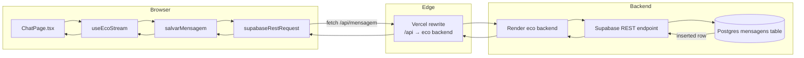
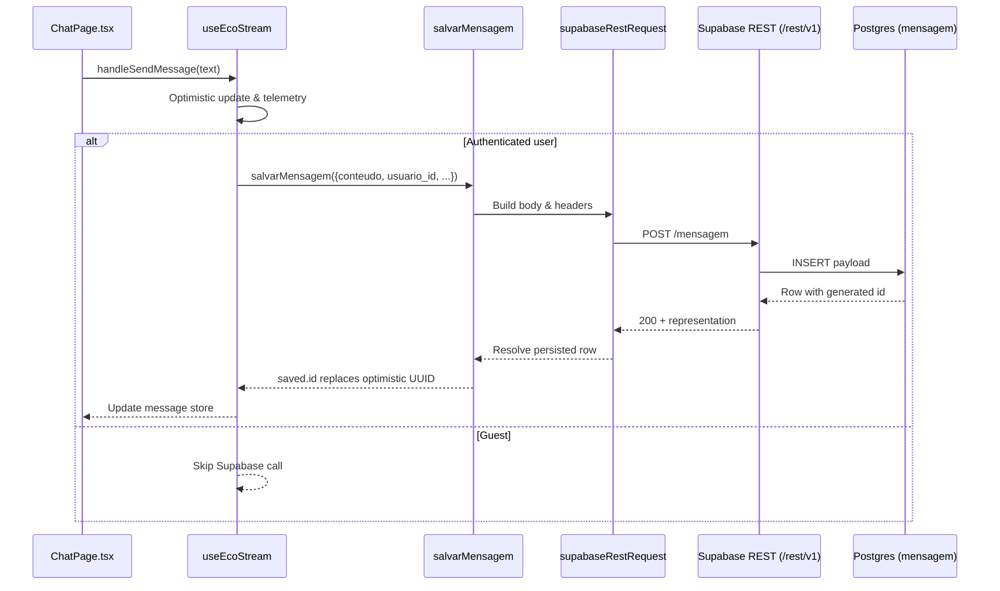

# Client-to-Database Request Flow

This document explains how a chat message travels from the Eco browser client to the `mensagem` table exposed by Supabase. It focuses on the frontend code path so maintainers can reason about which layer owns optimistic UI updates, authentication headers, request routing, and error handling along the way.

## High-level network route

The frontend never calls Supabase directly from the browser. Every REST call hits the local `/api` namespace, which Vercel rewrites to the Render backend, and only then reaches Supabase. 【F:src/api/mensagem.ts†L1-L64】【F:vercel.json†L1-L6】

## Call stack from UI to persistence

1. **Composer hands off to the streaming hook.** `ChatPage` wires every send action to `useEcoStream.handleSendMessage`, after applying guest limits and UI guards. 【F:src/pages/ChatPage.tsx†L262-L347】
2. **`useEcoStream` prepares optimistic state.** The hook logs client analytics, queues passive signals, and—when a Supabase session is present—starts persisting the user message before contacting the streaming backend. Guests skip Supabase entirely. 【F:src/hooks/useEcoStream.ts†L430-L520】
3. **`salvarMensagem` creates the REST payload.** It serializes the message body and delegates the HTTP call to `supabaseRestRequest`, ensuring the response includes the inserted row by setting `Prefer: return=representation`. 【F:src/api/mensagem.ts†L70-L101】
4. **`supabaseRestRequest` signs and routes the HTTP request.** The helper retrieves the active Supabase session, sets both the `apikey` and `Authorization` headers, and calls `fetch` against `/api/mensagem`. On the edge, Vercel rewrites that relative URL to the Render backend before it continues to Supabase. Non-2xx responses are turned into descriptive `Error`s. 【F:src/api/mensagem.ts†L34-L68】【F:vercel.json†L1-L6】
5. **Supabase REST writes to Postgres.** The backend forwards the request to Supabase, which inserts the JSON payload and returns the stored row (including the generated `id`). 【F:src/api/mensagem.ts†L70-L101】
6. **Optimistic IDs are reconciled.** When the promise resolves, the hook swaps the temporary UUID used in local state with the persisted `mensagem.id`. Failures leave the optimistic ID in place and are surfaced to the console in development mode. 【F:src/hooks/useEcoStream.ts†L456-L507】

> ℹ️  `supabaseRestRequest` relies on the shared client from `src/lib/supabaseClient.ts`, guaranteeing that the same credentials gate real-time listeners and REST calls. 【F:src/lib/supabaseClient.ts†L1-L6】

## HTTP request shape and headers

- **Method & URL:** `POST ${VITE_SUPABASE_URL}/rest/v1/mensagem` (relative path `/mensagem`). 【F:src/api/mensagem.ts†L34-L85】
- **Body fields:** At minimum `conteudo` (message text) and `usuario_id`; optional flags like `salvar_memoria` are forwarded untouched. 【F:src/hooks/useEcoStream.ts†L456-L463】【F:src/api/mensagem.ts†L70-L83】
- **Authentication:**
  - `apikey`: always set to `VITE_SUPABASE_ANON_KEY` so Supabase REST accepts the call. 【F:src/api/mensagem.ts†L34-L47】
  - `Authorization`: bearer token using the logged-in user's `access_token` when present; falls back to the anon key for guests. 【F:src/api/mensagem.ts†L34-L47】
- **Response contract:** With `Prefer: return=representation`, Supabase responds with the inserted row, letting the hook replace optimistic IDs without an extra query. 【F:src/api/mensagem.ts†L70-L93】

## Failure handling

- The hook logs (and tolerates) persistence failures so the chat experience does not block on Supabase outages. It keeps the optimistic UUID and proceeds with streaming. 【F:src/hooks/useEcoStream.ts†L464-L491】
- `supabaseRestRequest` throws rich errors containing the status code and body text, making upstream logging clearer. 【F:src/api/mensagem.ts†L53-L68】

## Mermaid sequence diagram

## Key takeaways

- Typed helpers (`salvarMensagem`, `listarMensagens`, etc.) keep Supabase headers and error handling consistent across the app. 【F:src/api/mensagem.ts†L70-L159】
- Environment variables `VITE_SUPABASE_URL` and `VITE_SUPABASE_ANON_KEY` must be available at build time so the REST base URL and anon credentials can be injected on the client. 【F:src/api/mensagem.ts†L4-L12】
- The shared Supabase client centralizes session lookup, so the same identity governs realtime subscriptions, REST calls, and optimistic UI reconciliation. 【F:src/lib/supabaseClient.ts†L1-L6】
